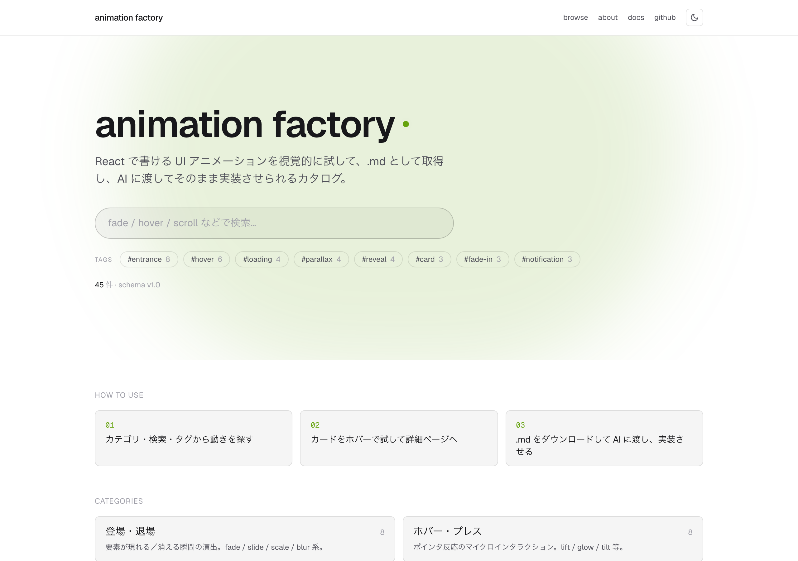

# animation factory



React 開発者向けの「アニメーションのカタログ」。あらゆる UI アニメーションを視覚的に試して、`.animation.md` パッケージとして取得し、AI に渡してそのまま実装させられる無料サイト。

🌐 **本番**: <https://animation-factory-five.vercel.app>
📚 **About**: <https://animation-factory-five.vercel.app/about>
📐 **Schema docs**: <https://animation-factory-five.vercel.app/docs/schema>

> 売上目的ではなく、自分が本当に欲しいアニメーションを誰でも使える形にするための個人発プロジェクト。

---

## AI / Agent から使う（3 経路）

「動きの辞書」をどんな AI / シェルからも引けるよう、3 つの入口を用意しています。

### 1. MCP サーバ（Claude Code / Cursor / Cline 等）

[Model Context Protocol](https://modelcontextprotocol.io) を喋れる AI クライアントなら、サイトを **そのまま「カタログ」として扱える** ようになります。AI が自律的に検索 → 取得 → 適用までやる。

```bash
# Claude Code に登録（一度だけ）
claude mcp add animation-factory --transport http \
  https://animation-factory-five.vercel.app/mcp

# Cursor / Cline 等も同じ URL を MCP HTTP transport で登録
```

登録後はチャットで:

> Card.tsx にホバーで浮き上がる動きを足して

…と頼むだけで、AI が `search_animations` → `get_animation("hover-lift")` → `AI Apply Prompt` セクションに沿って `Card.tsx` を編集します。

**公開ツール**:
- `search_animations(query?, category?, release?, tag?, limit?)` — 自然言語 + ファセット検索
- `get_animation(id)` — `.animation.md` 全文（frontmatter + 本文 + AI Apply Prompt）
- `list_categories()` — 全 7 カテゴリ + count
- `list_by_tag(tag)` — タグ絞り込み
- `get_kit(ids[])` — 複数 .md を 1 つの大きな markdown に連結

### 2. CLI（任意の AI / シェル / CI）

`fetch` できる Node 22+ ならどこでも動く単一ファイル CLI。MCP に対応していない AI（ChatGPT 等）に渡す `.md` をワンコマンドで取りに行けます。

```bash
# インストール不要、その場で実行（GitHub から）
npx github:Daichi8922028/animation-factory get fade-up hover-lift --out ./animations

# 検索
npx github:Daichi8922028/animation-factory search "ホバー" --category hover-press --limit 5

# 束ね DL（zip）
npx github:Daichi8922028/animation-factory kit fade-up hover-lift scroll-reveal --out .
```

`npm publish` 後は `npx animation-factory@latest get fade-up` で動きます（パッケージ詳細は `cli/README.md`）。

### 3. curl / fetch（MCP 未対応の AI、汎用エージェント）

最低限の依存。ChatGPT や GitHub Copilot にも「下の URL を読んで適用して」で渡せます。

```bash
# 1 件取得
curl -o fade-up.animation.md \
  https://animation-factory-five.vercel.app/api/animation/fade-up

# 複数の zip 取得
curl -o kit.zip \
  "https://animation-factory-five.vercel.app/api/kit?ids=fade-up,hover-lift,scroll-reveal"
```

**AI への指示例（ChatGPT）**:

```
このアニメーションを Card.tsx に適用して:
https://animation-factory-five.vercel.app/api/animation/hover-lift

末尾の "AI Apply Prompt" セクションに従ってください。
```

---

## ブラウザでカタログを使う

1. <https://animation-factory-five.vercel.app> を開く
2. カテゴリ / 検索 / タグから動きを探す
3. カードをホバーで試し、気に入ったら詳細ページへ
4. `.md をダウンロード` で 1 件、`add to kit` を貯めて画面下の `Kit を DL` で複数を zip 取得
5. 取得した `.animation.md` を AI に渡し、末尾の `AI Apply Prompt` に従って適用

---

## 設計ドキュメント（真正本）

設計の真正本は Obsidian の Vault 側にある。実装で迷ったらそちらを読む。

- ProjectBrief — アイデア本体・スコープ
- Roadmap — Phase 0〜5 の作業フロー
- Web-Animation-Taxonomy — アニメーションの MECE 5 軸
- Specs/animation-md-schema — `.animation.md` スキーマ v1.0（確定）
- Specs/react-implementability — Tier A / B / C 振り分け
- Specs/site-ia — サイト IA / データモデル
- Specs/ui-design — UI・ビジュアル設計
- Specs/preview-engine — プレビュー基盤の技術選定
- Specs/implementation-plan — 本リポジトリの進め方

Vault: `10_Projects/アニメーション工場/`

## 技術スタック

- Next.js 16（App Router）+ TypeScript
- Tailwind CSS v4
- Motion / GSAP（Tier B のスクロール演出）/ Lottie / Rive
- Zod（`.animation.md` フロントマターの検証）
- JSZip（複数 .md の束ね DL）
- marked + shiki（詳細ページの Markdown / コードハイライト）
- Playwright（E2E + 静的サムネ生成）
- ホスティング: Vercel 無料枠

## 構成

```
src/                  Next.js アプリ（App Router）
  app/(site)/         ホーム / カテゴリ / 詳細 / タグ / about / docs
  app/mcp/route.ts    MCP サーバ（stateless HTTP, JSON-RPC 2.0）
  app/api/            REST API（/api/animation/[id], /api/kit）
cli/                  animation-factory CLI（独立サブパッケージ）
content/animations/   本番の *.animation.md
content/docs/         About / Schema docs の Markdown
scripts/              .animation.md → 索引・プレビューサムネのビルド
tests/e2e/            Playwright 致命パス E2E
src/generated/        animation-index.json（ビルド成果物、git 管理外）
public/thumbs/        Playwright で撮影した各プレビューのサムネ
```

## 開発

```bash
npm run dev            # 開発サーバ
npm run verify         # lint + content check + production build + E2E
npm run test:e2e       # production build 後に Playwright E2E
npm run check:content  # .animation.md の v1.0 スキーマ検証
npm run build:index    # content から索引を生成（dev/build 前に自動実行）
npm run build:thumbs   # /preview/[id] を Playwright で全件キャプチャ
npm run build          # 本番ビルド
npm run lint           # ESLint
```

## CI / CD

- CI: `.github/workflows/ci.yml`
  - `main` への push と pull request で `npm run verify` を実行
  - 検証内容: ESLint、`.animation.md` 検証、Next.js production build、Playwright E2E
- CD: `.github/workflows/vercel-production.yml`
  - 手動実行（workflow_dispatch）で Vercel production に prebuilt deploy
  - Vercel CLI の `pull -> build -> deploy --prebuilt --prod --archive=tgz` 構成
  - GitHub Secrets: `VERCEL_TOKEN` / `VERCEL_ORG_ID` / `VERCEL_PROJECT_ID`

## セキュリティ

- 基本ヘッダ済（X-Frame-Options=SAMEORIGIN / X-Content-Type-Options=nosniff / Referrer-Policy / Permissions-Policy）
- API 入力は regex 検証 + 件数上限（kit max 50）
- back-link の `?from=` は `/c/` `/t/` `/a/` `/?q=` のみ受理（外部 URL は home にサニタイズ）
- 現状の `.md` 本文は curated（user 投稿なし）。Phase 4 で user 投稿を入れる時は `DOMPurify` で sanitize する想定

## ステータス

Phase 3（ベータ版）コア完成。本番 deploy 済、E2E 13/13 OK、コンテンツ 45 件（alpha 38 + beta 7）、全 7 カテゴリ充足。AI 連携 3 経路（MCP / CLI / curl）公開。次は Phase 4（任意拡張：ユーザー投稿）/ Phase 5（Tier C: 3D / シェーダ / 物理）。
